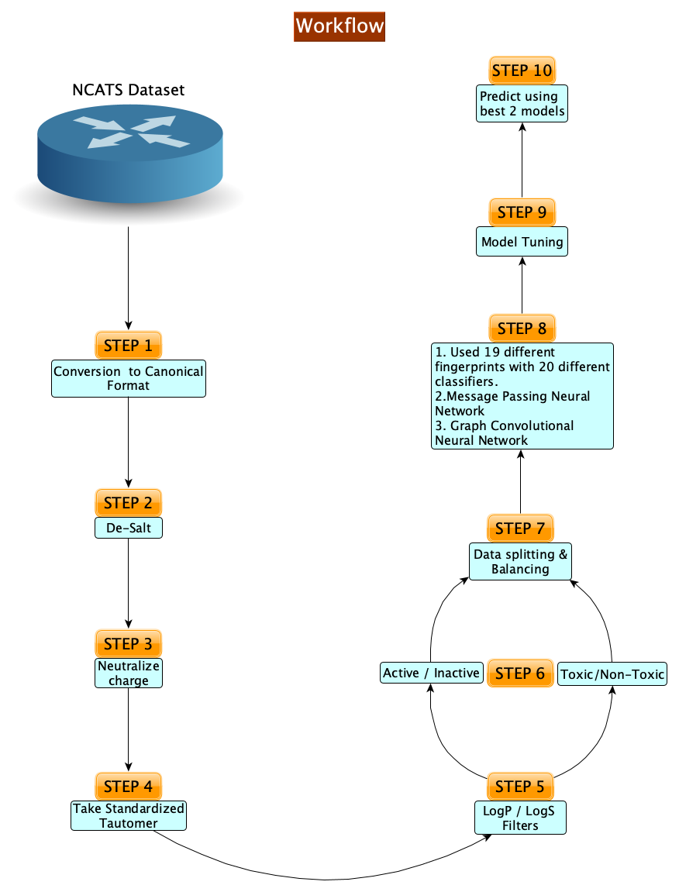

# REDIAL - 2020
This repository contains ML models for predicting Anti-SARS-CoV-2 Activities (`Live Virus Infectivity`, `Viral Entry`, `Viral Replication`) and for performing Similarity Search<br/>
- Website: http://drugcentral.org/Redial
<!---
Below is the workflow. Uncomment out if necessary

-->

## Table of Contents

- [Requirements](#requirements)
- [Installation and Initialization](#installation-and-initialization)
  * [Docker](#docker)
    * [Run Docker Images](#1-run-docker-images)
    * [Build your own images](#2-build-your-own-images)
  * [Manual Start](#manual-start)
- [Docker API Content](#docker-api-content)
- [Contributors](#contributors)
- [Funding](#funding)
- [Acknowledgements](#acknowledgments)
- [License](#license)

## Requirements

At the moment, a standard machine with CPUs will work. 

## Installation and Initialization

Currently, we suggest two ways to run REDIAL-2020 locally: Docker and manually running from source. With Docker, you can either pull an image from DockerHub, or build one on your own.

### Docker
To install Docker, just follow the [docker documentation](https://docs.docker.com/install/).
#### 1. Run Docker Images
The latest Redial-2020 images are available on the Docker Hub.
- `docker pull sirimullalab/redial-2020:latest`
- `docker run -p 5000:5000 sirimullalab/redial-2020:latest`
- `curl -F smiles='CCCC' localhost:5000/predict` OR `curl -d 'smiles=CCCC' localhost:5000/predict`

#### 2. Build your own images
1. `git clone this repo`
2. `cd /path/to/this/repo`
3. `docker build --build-arg USER=$USER --build-arg UID=$UID --build-arg GID=$GID -t redial-2020 .`
4. `docker run -p 5000:5000 redial-2020`
5. `curl -F smiles='CCCC' localhost:5000/predict` OR `curl -d 'smiles=CCCC' localhost:5000/predict`
> NOTE: The API accepts form-request / post-request.

### Manual Start
1. Install Miniconda, for your operating system, from [https://conda.io/miniconda.html](https://conda.io/miniconda.html)
2. `git clone this repo`
3. `cd /path/to/this/repo`
4. `conda env create -f environment-redial-2020.yml`
5. `conda activate redial-2020` (or `source activate redial-2020` for older versions of conda)
6. Example Commands :
```
python3 redial_batch_screen.py --input_path <PATH_TO_CSV_FILE> --output_path <PATH_TO_SAVE_JSON_FILE> --calculate_alogps <Bool>
```
```
python3 redial_batch_screen.py --input_path test.csv --output_path ./ --calculate_alogps 1
```
> Note: 
> 1. Input csv file should contain atleast one column having `SMILES` as column name.
> 2. Predictions along with ALOPGS calculations may be slow, due to OCHEM API limitations. For faster predictions, use `--calculate_alogps 0`

### Docker API Content
API URL: `hostname:port/predict`
- Found here - `./docker_api_content.yml`

### Contributors
[Srijan Verma](https://www.linkedin.com/in/vermasrijan/), [Govinda KC](https://github.com/Govindakc), [Mahmudulla Hassan](https://github.com/hassanmohsin), [Giovanni Bocci](https://www.linkedin.com/in/giovanni-bocci-88b659b7/), [Suman Sirimulla](https://expertise.utep.edu/node/36435), [Tudor I. Oprea](https://vivo.health.unm.edu/display/n7948) <br/><br/>
<!---
### TODO:
1. Handle Flask cache error (duplicate tables are displayed at the moment ; use flask reload maybe)
2. Add alogps functionality (either `rest api` or using `alopgs ochem linux tool`)
3. Add updated best models
4. Handle error correctly (empty smiles, invalid smiles, other)
5. Workflow for 1000 SMILES
-->

### Acknowledgments
Suman Sirimulla acknowledge support from the National Science Foundation with `NSF-PREM grant #DMR-1827745.`

### License
[MIT License](https://github.com/sirimullalab/redial-2020/blob/master/LICENSE)
